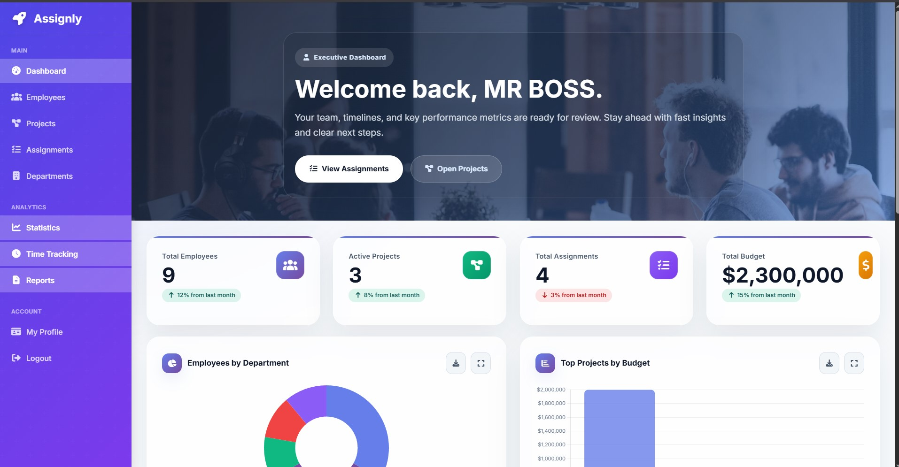

<!-- BANNER -->

  

<h1 align="center">Hi 👋, I'm Rimer-Rey A. Gabaleo 
</h1>

<h4 align="center">
🧠 Passionate about designing experiences that are simple, accessible, and enjoyable for people to use.

Turning curiosity into creativity through design, code, and continuous learning.
</h4>
<h4>

</h4>

  

---

## 🚀 About Me
 

 

 

 

 

 

 

 

---
## 🎓 Educational Project Experience

<table>
<tr>
<td width="60%">

</td>

<td width="40%" valign="top">

### **Web Application Development
Assignly — Staff Management System 

Designed and developed a modern staff management system focused on creating a clean, intuitive, and user-friendly experience for managing departments, employees, projects, and assignments. This project allowed me to explore UI/UX principles, responsive interface design, and frontend development while implementing secure backend functionality using Laravel.

### 🔗project link <a href="https://github.com/rimerGAB/WAD-PROJECT-ASSIGNLY">View Repository</a>

</td>
</tr>
</table>

---

---
## 🛠️ Languages & Tools

---

## 📊 GitHub Stats

  

---

## 🌐 Connect With Me

